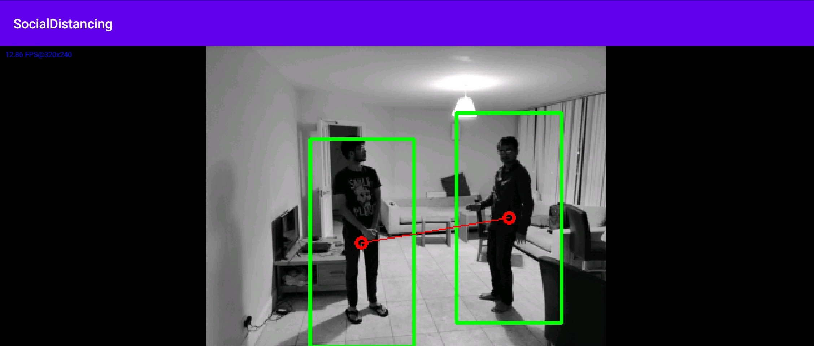

# Social-Distancing
Social Distancing Application made with OpenCV and Android

In indoor settings, for social gatherings, people can check whether social distancing is followed or not.

Using, Histogram of Oriented Gradients, people are detected and pairwise distances are calculated.

For more information and queries, please feel free to email me.

Application demo:

Screenshots:

OpenCV for Android SDK version: 3.4.10

Tested on Android 10 - API 29

More screenshots present in the app-demo folder.
